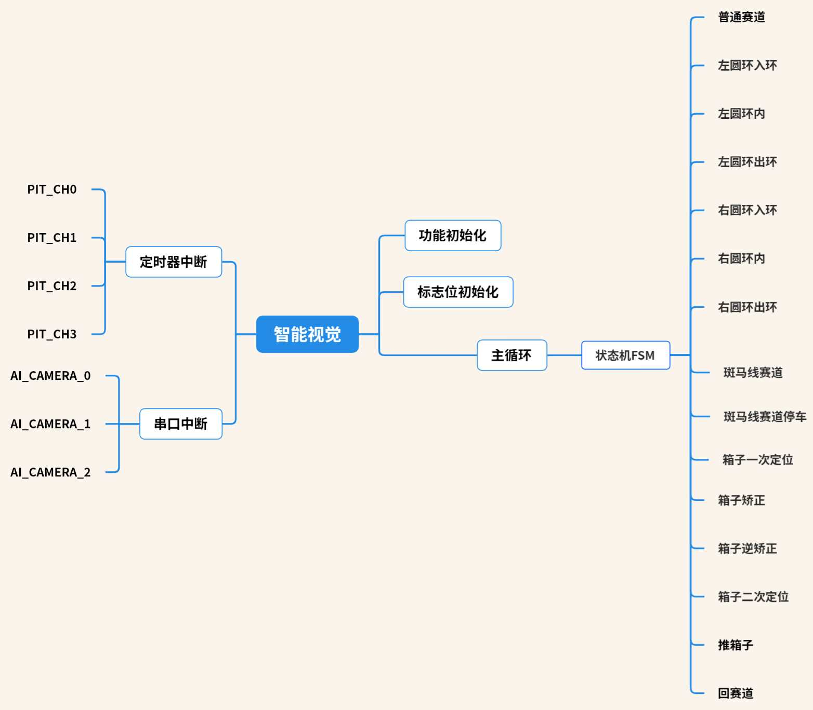

# <i>20届智能视觉组</i>
# <b>鹭岛躺赢狗队</b>

# <b>工程文件简述</b>
## <b>DOG库</b>
| 文件名 | 简述 |
|:-:|:-:|
| <b>code/DOG_cv.c(h)<b> | 机器视觉：图像处理 |
| <b>code/DOG_filter.c(h)<b> | 滤波器（卡尔曼、低通） |
| <b>code/DOG_menu.c(h)<b> | 菜单 |
| <b>code/DOG_motor.c(h)<b> | 电机 |
| <b>code/DOG_path.c(h)<b> | 循线（八邻域、最长白列、中线） |
| <b>code/DOG_pid.c(h)<b> | PID控制器 |
| <b>code/DOG_sensor.c(h)<b> | 传感器 |
| <b>code/DOG_solve.c(h)<b> | 解算（欧拉角、运动学正/逆解算） |
| <b>code/DOG_timer.c(h)<b> | 计时器 |
| <b>code/DOG_vofa.c(h)<b> | VOFA协议 |
| <b>code/DOG_data.h<b> | DOG库变量类型 |

## <b>USER库</b>
| 文件名 | 简述 |
|:-:|:-:|
| <b>code/ai.c(h)<b> | AI摄像头 |
| <b>code/control.c(h)<b> | 控制（角度环、方向环、速度环、箱子定位） |
| <b>code/fsm.c(h)<b> | 状态机 |
| <b>code/menu.c(h)<b> | 菜单 |

# <b>工程结构简述</b>
 
## 状态机简述
| 状态名 | 简述 | 切换关系 |
|:-:|:-:|:-:|
| <b>common_path(普通赛道)</b> | 普通赛道状态，直道/弯道循迹 | 无 |
| <b>L_circle_in(左圆环入环)/<b> | 左圆环入环状态，向左入环 | 满足入环条件，<b>common_path->L_circle_in</b>，完成入环后切换至<b>L_circle</b> |
| <b>L_circle(左圆环内)</b> | 左圆环内状态 | 无 |
| <b>L_circle_out(左圆环出环)</b> | 左圆环出环状态，向左出环 | 满足出环条件，<b>L_circle->L_circle_out</b>，完成出环后切换至<b>common_path</b> |
| <b>R_circle_in(左圆环入环)</b> | 右圆环入环状态，向右入环 | 满足入环条件，<b>common_path->R_circle_in</b>，完成入环后切换至<b>R_circle</b> |
| <b>R_circle(左圆环内)</b> |  右圆环内状态| 无 |
| <b>R_circle_out(左圆环出环)</b> | 右圆环出环状态，向右出环 | 满足出环条件，<b>R_circle->R_circle_out</b>，完成出环后切换至<b>common_path</b> |
| <b>zebra_path(斑马线赛道)</b> | 斑马线赛道状态 | 识别到斑马线后，<b>common_path->zebra_path</b>，记录当前位置相对于出发点路程，若实时路程与斑马线路程的差值超过阈值则停车 |
| <b>box_first_track(箱子一次定位)</b> | 箱子一次定位状态，第一次看到箱子后贴近箱子 | 识别到箱子后，若满足范围条件，<b>common_path->box_first_track</b>或<b>L/R_circle->box_first_track</b>并记录切换前的状态，否则返回切换前的状态 |
| <b>box_calibration(箱子矫正)</b> | 箱子矫正状态 | <b>box_first_track</b>定位完成后，<b>box_first_track->box_calibration</b>进行对称法矫正，对称度超过阈值则切换至<b>box_second_track</b>,若不满足则切换至<b>box_inv_calibration</b> |
| <b>box_inv_calibration(箱子逆矫正)</b> | 箱子逆矫正状态，反转 | 反转回<b>box_calibration</b>状态时记录的对称度最大处，转动完成后，切换至<b>box_second_track</b> |
| <b>box_second_track(箱子二次定位)</b> | 箱子二次定位状态，对正箱子 | 对正箱子，对正完成后切换至<b>box_fxxk</b> |
| <b>box_fxxk(推箱子)</b> | 推箱子状态，将箱子推出界 | 推离箱子，推离完成后，记录相对于出发点的路程，切换至<b>path_back</b> |
| <b>path_back(返回赛道)</b> | 返回赛道状态，向后倒车，旋转90度 | 倒车，当前位置相对于出发点路程-<b>box_fxxk</b>记录的路程超过阈值，停车，旋转90度正对赛道，切换至<b>box_first_track</b>中记录的切换前的状态 |

## 日志
| 日期 | 工作内容 |
| :---: | :--- |
| <i><b>2025.7.9 | 1.完成除菜单外所有功能开发 2.添加箱子定位时的旋转 |
| <i><b>2025.7.10 | 1.删除箱子定位时的旋转 2.重构完毕，菜单移植 |
| <i><b>2025.7.11 | 1.添加缓变速 2.将圆环入环出环从原来的给定旋转速度更改位设置了圆环出入环的输出限幅的角度环PID 3.删除zebra_path_stop状态 |
| <i><b>2025.7.12 | 1.添加模糊规则表 2.将圆环出入环计时器更改路程 3.添加单双OPENART预定义，可通过更改宏定义实现单双OPENART切换 4.添加Y缓变速 5.添加Y速度阈值，当大于该阈值才使用X方向速度 6.添加方案选择 |
| <i><b>2025.7.13 | 1.将矫正阶段的旋转速度赋值改为由真实X速度×比例，而非目标速度×比例 2.修改AI CAMERA0菜单，添加矫正X速度和比例选项 3.箱子定位判断条件，将较上次箱子路程大于一定阈值改为当前坐标与上次箱子坐标距离大于一定阈值 |
| <i><b>2025.7.14 | 1.将矫正阶段的旋转速度赋值换回目标速度×比例 2.添加模糊速度环 3.修改推箱子时的角度闭环为角速度Kd抑制 4.融合编码器和陀螺仪，提高运动学解算的准确度（实测赛道循线一圈，航向角偏移1.0°以内） 5.将完成箱子得各个步骤后停车加回来，不加也可以，只不过要保证标志位不会被改变 6.修复角度环旋转模糊pid，将输入err参数改为err而非角度 7.加入RWR音效 8.优化识别结果显示菜单逻辑 9.我讨厌试错😭 |
| <i><b>2025.7.15 | 1.添加矫正阶段的X速度缓变速，并将旋转速度修改为当前X目标速度*比例 2.修改缓变速函数，可以传入缓变速率，并删除缓变速计时器和缓变速功能对时间的依赖 |
| <i><b>2025.7.18 | 1.添加回赛道缓变速 2.添加角速度驱动的动态前瞻 3.修改定位箱子PID 4.添加推箱子时的X PID 5.将动态前瞻的参数加入菜单循线页面 6.添加普通摄像头页面，可以调整曝光时间 7.修复箱子逆矫正有时候一直旋转的BUG |
| <i><b>2025.8.12 | 1.添加flash存储数据 2.添加低速短前瞻，防止十字弯处有箱子导致推箱子后的抄近道重复看到箱子 |
| <i><b>2025.8.13 | 1.添加长按按键存储程序内的参数修改值 2.更换循迹参数，在同样速度下确保循迹稳定性 |
| <i><b>2025.8.15 | 1.添加缓加速前瞻，不使用之前的圆环前瞻作为缓加速前瞻，防止改变圆环的时候缓加速出问题 |
| <i><b>2025.8.23 | 1.添加补光灯（0：常关；1：循迹开，识别关；2：循迹关，识别开；3：常开） |

# [🐧要做一辈子嵌入式开发!!!!!🐧](https://github.com/Geek-Egret)